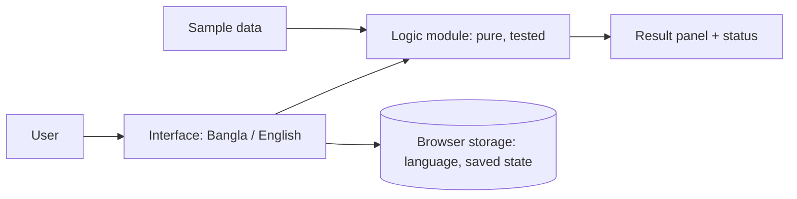

# Final README Template (judge-friendly, solo participant)

> **How the agent uses this file**
> 1. Copy everything below the horizontal rule into the contest repository as `README.md`.
> 2. Fill every `[bracket]` from project memory and real output (see `skills/devfest-vibe-coding/references/README_GENERATION.md`). Never invent a value.
> 3. Delete every `<!-- AGENT: ... -->` comment.
> 4. Remove a section only if it truly does not apply (for example Screenshots when the statement does not require them). Never remove a rulebook-required field.
> 5. Style reference: `REFERENCE_README_EXAMPLE.md` (clarity and structure only; do not copy its text, names, links, badges, or its backend content).
> 6. Write for a stranger who has 60 seconds. Plain words, exact UI label names, no internal jargon.

---

<div align="center">

# [App Name]
### *[One line: what it does, for whom]*

<!-- AGENT: badges only for technologies actually used, e.g. Vite, React, TypeScript, Vitest. Omit badges if unsure. -->

**[Live demo]([PUBLIC HTTPS URL])** · **[Repository]([REPO URL])** · English / বাংলা

</div>

---

## At a glance · সংক্ষেপে

**English.** [Two plain sentences: who uses this, what problem it solves, what they get.]

**বাংলা।** [Same meaning in two natural Bangla sentences.]

## Participant

| Field | Value |
|---|---|
| Full name | [Full Name] |
| Registration number | [Registration Number] |
| Contest | AI DevFest Vibe-Coding Contest (Solo), DIU CPC, 6 October 2026 |
| Live site | [PUBLIC HTTPS URL] |
| License | MIT |

## 60-second judge tour

<!-- AGENT: write only the click path you actually ran on the live site. Use the exact button labels. -->

1. Open the [live site]([PUBLIC HTTPS URL]) in Chrome. No login or installation is needed.
2. [First action, e.g. click **Load sample data**.]
3. [What you should see, in one sentence. Name the main result.]
4. [A second action that shows a rule working, e.g. change X and watch the result update immediately.]
5. Press **[language switch label]** to switch to বাংলা. Labels, statuses, and error messages change too.

## The problem

[3–5 plain sentences: the organizational situation from the statement, the user, the workflow, and what the app must output. Define any term the reader may not know.]

## Key features

| Feature | What you can do | Where to find it |
|---|---|---|
| [Feature 1] | [Action and outcome] | [Screen / panel / button] |
| [Feature 2] | [Action and outcome] | [Screen / panel / button] |
| [Feature 3] | [Action and outcome] | [Screen / panel / button] |

## Bonus features

- [Bonus 1, only if it works]
- [Bonus 2]

<!-- AGENT: if there are none, write "None in this submission." -->

## Screenshots

<!-- AGENT: only when the statement requires screenshots. Use the exact folder name from the statement. List only files that exist in the final commit. Add alt text. -->

| State | Image |
|---|---|
| [Required state 1, e.g. baseline] | ![[alt text]](screenshots/[file]) |
| [Required state 2] | ![[alt text]](screenshots/[file]) |

## How it works



<!-- AGENT: redraw to match what really exists, 6–12 nodes, no server. -->

1. [Step: input enters through ... and is validated; errors are returned as codes.]
2. [Step: the logic module computes the result deterministically; ties are broken by ...]
3. [Step: the interface shows the result and the exact status text in the selected language.]
4. [Step: every change recalculates immediately; Reset restores ...]

## Rules and edge cases handled

| Rule from the problem | How the app handles it | Verified by |
|---|---|---|
| [e.g. equal results are ordered by ...] | [Behavior] | [test name] |
| [e.g. invalid input] | [All errors listed; previous valid data kept] | [test name] |
| [e.g. limit of N items] | [At N accepted, N+1 rejected with message] | [test name] |

## Bangla and English

The interface works fully in both languages, including statuses, instructions, and validation errors. The language choice is remembered in the browser. Dataset labels and numbers stay exactly as supplied.

| Meaning | English | বাংলা |
|---|---|---|
| [Status text] | [exact English string] | [Bangla string] |
| [Validation error] | [English] | [Bangla] |
| [Button] | [English] | [Bangla] |

## Requirement coverage

<!-- AGENT: generate from docs/problem/LEDGER.md. Status words must be Done, Partial, or Not done, with evidence. Never mark Done without evidence. -->

| # | Requirement (plain words) | Status | Evidence |
|---|---|---|---|
| R1 | [requirement] | Done | [test name or screen] |
| R2 | [requirement] | Partial | [what is missing] |

## Tech stack

| Layer | Technology |
|---|---|
| App | [framework, language, build tool] |
| Logic tests | [test runner] |
| Storage | Browser only (localStorage / sessionStorage) [as applicable] |
| Hosting | [Vercel / Netlify / Cloudflare Pages / GitHub Pages] (static, HTTPS) |
| Fonts / icons | [names and licenses] |

No backend, no database, no API keys.

## Run locally

```bash
[install command]
[dev command]
```

Open `[local URL]`.

## Tests and production build

```bash
[test command]
[build command]
```

<!-- AGENT: state the real result you saw, e.g. "N tests pass". Only if you ran them in the final state. -->

## Project structure

```text
[paste the real tree, annotated in one short phrase per item]
```

## Contest compliance

| Rule | Status |
|---|---|
| Frontend only, no participant backend or serverless functions | Yes |
| No participant-controlled database or online storage | Yes |
| Main features work without the optional AI feature | [Yes / not applicable] |
| No API key in code, history, or the deployed site | Yes |
| Bangla and English for all main text | Yes |
| Public HTTPS site, no login, no installation | Yes |
| Only contest-provided sample data | Yes |
| Commits list what changed and the prompt used (or `Manual edit`) | Yes, see [docs/BUILD_LOG.md](docs/BUILD_LOG.md) |
| MIT license | Yes, see [LICENSE](LICENSE) |

## Assumptions and known problems

- **Assumption:** [where the statement was ambiguous and what you chose]
- **Known problem:** [honest limitation and its impact]
- **Next step:** [one short, realistic improvement]

## AI tools used

- [Tool / model and what it was used for]
- [Tool / model]

## Most useful prompt

> [Paste the single most useful prompt actually used during the contest, unchanged.]

## How this was built

Built solo inside the 90-minute contest window with AI coding assistance driven by prompts.

- Every commit message records what changed and the prompt used (or `Manual edit`).
- The running log, including decisions and bugs found, is in [docs/BUILD_LOG.md](docs/BUILD_LOG.md).
- The original problem statement and sample data are kept untouched in [docs/problem/](docs/problem/).

<!-- AGENT: if a written instruction kit (Markdown only, no project code) was loaded AND organizers allowed it, add one plain sentence saying so. Never claim a tool that was not used; never hide one that was. -->

## Data and licensing

Uses only the contest-provided sample data. No real personal or private company data is included. Third-party packages, fonts, and icons are used under their own licenses ([list them]).

## License

MIT. See [LICENSE](LICENSE).
